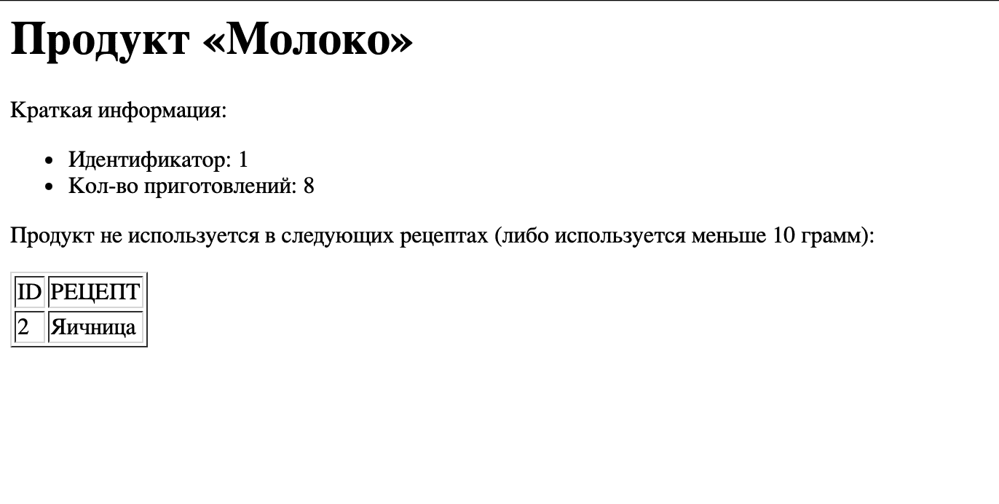
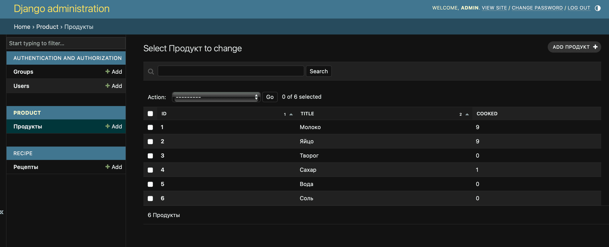
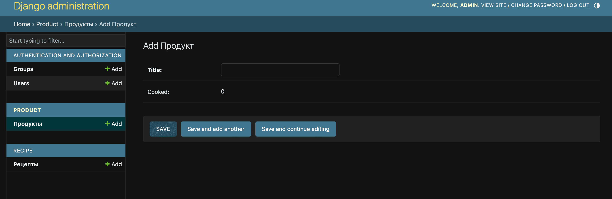
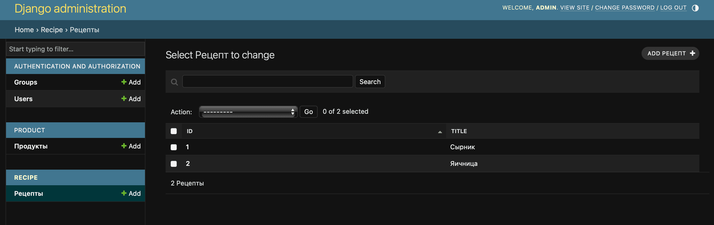
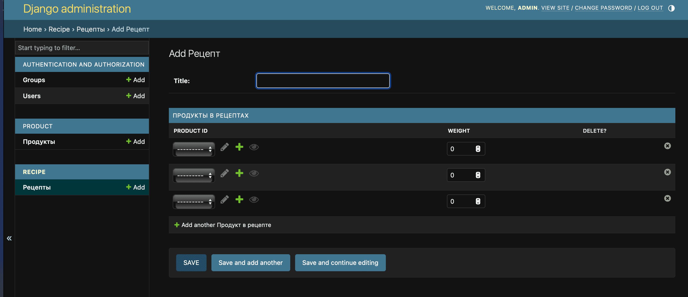

# Поварская книга
## Содержание
* [Описание](#description)
* [Установка и настройка](#install)
  * [Перед тем, как начать](#install-python)
  * [Клонирование репозитория](#install-git)
  * [Файл .env](#install-env)
  * [Установка библиотек](#install-utils)
  * [Миграции БД](#install-migrations)
  * [Запуск](#install-start)
* [Состав страниц сайта](#pages)
* [Административный раздел](#adminpanel)
* [Используемые библиотеки](#utils)

<a name="description"></a>
## Описание
Поварская книга позволяет HTTP запросы методом GET, такие как добавление продукта в рецепт или обновление его веса в рецепте, увеличение кол-ва приготовлений продуктов и вывод рецептов без использования определенного продукта либо с использованием менее 10 грамм.\
Администрирование происходит через админ-панель Django.

Стэк: Django, PostgreSQL, Poetry.

<a name="install"></a>
## Установка и настройка
<a name="install-python"></a>
### Перед тем, как начать
* Проверьте, что у вас установлен `Python` и есть виртуальное пространство

<a name="install-git"></a>
### Клонирование репозитория
* Перейдите в папку проекта и выполните команду в консоли `git clone`, чтобы скопировать файлы репозитория
```
git clone https://github.com/PanicNyan/cook_book.git
```

<a name="install-env"></a>
### Файл .env
* Скопируйте файл `.env.template` или его содержимое и сохраните под именем нового файла `.env`
* Укажите данные базы данных в файле `.env`

<a name="install-utils"></a>
### Установка библиотек
* Перейдите в папку проекта и установите менеджер пакетов Poetry
```
pip install poetry
```
* После установите все зависимости
```
poetry install
```

<a name="install-migrations"></a>
### Миграции БД
* В папке проекта перейдите к файлу `manage.py` и введите команду в консоль для миграций БД 
```
python manage.py migrate
```

<a name="install-start"></a>
### Запуск
* Запустите проект командой
```
python manage.py runserver
```
* Откройте в браузере страницу по адресу `http://127.0.0.1:8000/`

<a name="pages"></a>
## Страницы сайта
* Информация о продукте и рецепты без этого продукта.
  * `http://127.0.0.1:8000/product/recipes_without_product?product_id={id}`
  * Описание: подставьте id продукта и получите информацию о его количестве приготовлений, и таблицы с id и названием рецепта, где этот продукт либо отсутствует, либо используется меньше 10 грамм.
* Приготовление по рецепту
  * `http://127.0.0.1:8000/recipe/cook?recipe_id={id}`
  * Описание: Подставьте id рецепта, чтобы сделать его приготовление. Каждый ингредиент состоящий в рецепте будет использован и увеличится кол-во приготовления на 1.
* Добавление продукта в рецепт
  * `http://127.0.0.1:8000/recipe/add_product?recipe_id={id}&product_id={id}&weight={number}`
  * Описание: Подставьте id рецепта, продукта и вес, чтобы добавить в рецепт указанное кол-во продукта. Если продукт уже есть в рецепте, то обновится его используемый вес.
* Административный раздел:
  * Просмотр/доб./ред. продуктов.
  * Просмотр/доб./ред. рецептов.



<a name="adminpanel"></a>
## Административный раздел
Для доступа к админ панели необходимо создать суперпользователя и следовать инструкции:
```
python manage.py createsuperuser
```
После перейти к админ-панели по адресу `http://127.0.0.1:8000/admin/`

Используется стандартная админ-панель Django и доступна только администратору, который может полностью управлять такими данными:
* Рецепты
* Продукты






<a name="utils"></a>
## Используемые библиотеки
python = "^3.12"\
django = "^5.0.1"\
psycopg2 = "^2.9.9"\
python-dotenv = "^1.0.1"